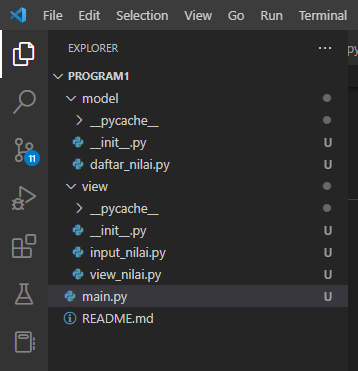
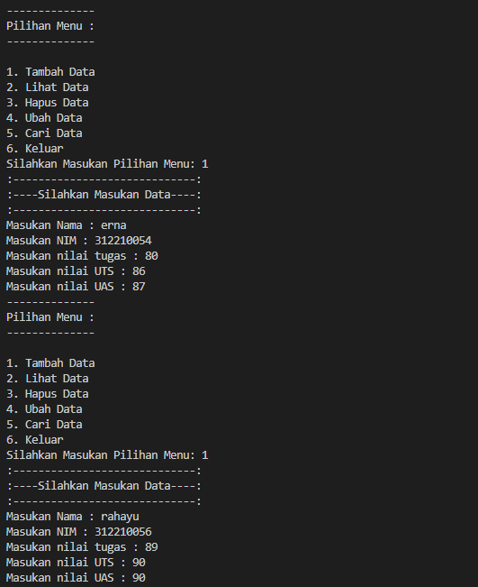
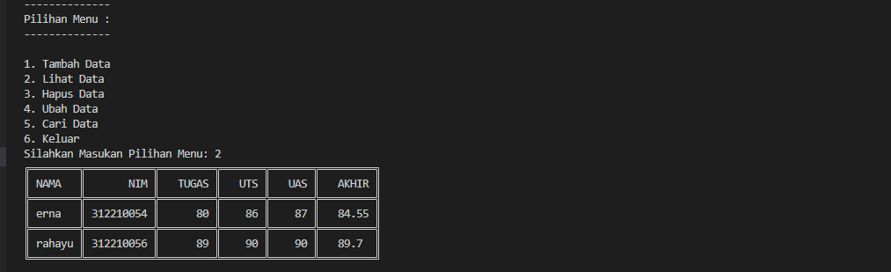
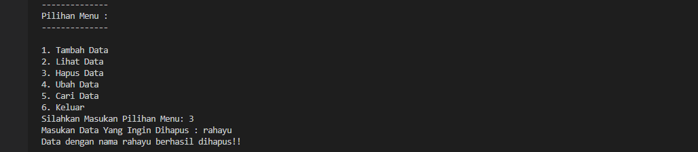
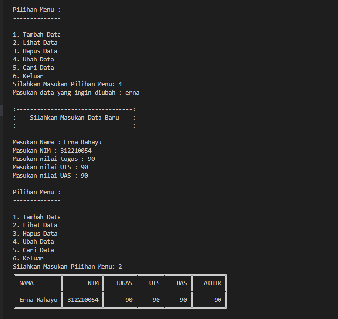
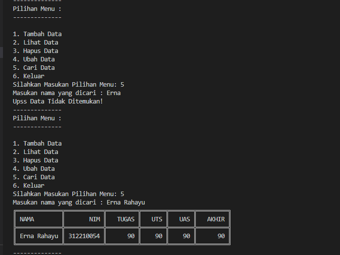
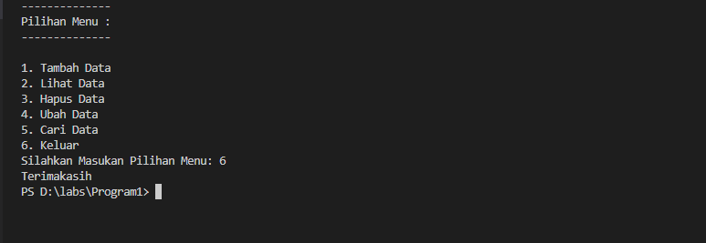

UAS Bahasa Pemrograman
```bash
Nama : Erna Rahayu
NIM  : 312210054
Kelas: TI.22.C1
```

# Link YouTube Tutorial Program

Lihat [disini!]()

# Ketentuan Program


# Penjelasan Program 
Untuk membuat Program tersebut pertama buat package yang berisi file seperti dalam ketentuan di atas.

1. **daftar_nilai.py**

File ini terletak pada folder model dan berisi beberapa fungsi yaitu tambah_data, ubah_data, hapus_data, dan cari_data dan berisi database berupa dictionary

Berikut Code Program ```daftar_nilai.py```
```bash
database = {}

def tambah_data(nama, nim, tugas, uts, uas, akhir):
    database[nama] = nama, nim, tugas, uts, uas, akhir

def proses_hapus_data(nama):
    if nama in database.keys():
        del database[nama]
        print(f'Data dengan nama {nama} berhasil dihapus!!')
        return True
    else:
        print(f'Upss nama {nama} tidak ditemukan!!')
        return False

def proses_ubah_data(nama):
    if nama in database.keys():
        del database[nama]
        print()
        print(":----------------------------------:")
        print(":----Silahkan Masukan Data Baru----:")
        print(":----------------------------------:")
        print()
        nama = input("Masukan Nama : ")
        nim =int(input("Masukan NIM : "))
        tugas =int(input("Masukan nilai tugas : "))
        uts =int(input("Masukan nilai UTS : "))
        uas =int(input("Masukan nilai UAS : "))
        akhir =float((0.30*tugas)+(0.35*uts)+(0.35*uas))
        tambah_data(nama, nim, tugas, uts, uas, akhir)
    else :
        print("Data tidak ditemukan")

def cari_data():
    from view.view_nilai import cari
    cari(input("Masukan nama yang dicari : "))
```
2. **input_nilai.py**

Selanjutnya saya membuat fungsi untuk meminta user memsaukan data / input yang berada pada file input_nilai.py yang berada pada modul view dan input user di gabung dengan fungsi yang sudah saya buat sebelumnya pada daftar_nilai.py untuk memasukan inputan user ke database(dictionary)

Berikut Code Perogram yang berada pada ```input_nilai.py```
```bash
from model.daftar_nilai import tambah_data, proses_hapus_data, proses_ubah_data

def masukan_data():

    print(":-----------------------------:")
    print(":----Silahkan Masukan Data----:")
    print(":-----------------------------:")

    nama = input("Masukan Nama : ")
    nim =int(input("Masukan NIM : "))
    tugas =int(input("Masukan nilai tugas : "))
    uts =int(input("Masukan nilai UTS : "))
    uas =int(input("Masukan nilai UAS : "))
    akhir =float((0.30*tugas)+(0.35*uts)+(0.35*uas))
    tambah_data(nama, nim, tugas, uts, uas, akhir)

def hapus_data():
    proses_hapus_data(input("Masukan Data Yang Ingin Dihapus : "))

def ubah_data():
    proses_ubah_data(input("Masukan data yang ingin diubah : "))
```

3. **view_nilai.py**

Selanjutnya saya membuat fungsi untuk menampilkan semua data yang ada dan fungsi untuk menampilkan hasil pencarian user dengan menggunakan modul tabulate data untuk mempercantik tabel dan memanggil database(dictionary) yang ada pada modul ```daftar_nilai.py```

Berikut code program ```view_nilai.py```

```bash
from model.daftar_nilai import database 
from tabulate import tabulate 
def lihat_data():
    print(tabulate(database.values(), headers=["NAMA", "NIM", "TUGAS", "UTS", "UAS","AKHIR"], tablefmt="double_grid"))

def cari(nama):
    
    for key, value in database.items():
        if nama in value:
            print(tabulate(database.values(), headers=["NAMA", "NIM", "TUGAS", "UTS", "UAS","AKHIR"], tablefmt="double_grid"))
        else :
            print("Upss Data Tidak Ditemukan! ")
```
4. **main.py**

Terakhir saya membuat file main.py yang berisi code program untuk menyatukan semua fungsi yang ada di beberapa modul yang telah saya buat sebelumnya dengan mengimport modul dan fungsi yang akan saya pakai ke dalam main.py dan saya membuat perulanagn menggunakan ```while True:```  untuk mebuat perulangan pada pilihan menu yang akan tampil sebagai pilihan user.

Berikut Code program ```main.py```
```bash
while True:
    print("--------------")
    print("Pilihan Menu :")
    print("--------------")
    print()
    print("1. Tambah Data")
    print("2. Lihat Data")
    print("3. Hapus Data") 
    print("4. Ubah Data")
    print("5. Cari Data") 
    print("6. Keluar")

    pilihan=input("Silahkan Masukan Pilihan Menu: ")

    if pilihan == '1':
        from view.input_nilai import masukan_data
        masukan_data()

    elif pilihan == '2':
        from view.view_nilai import lihat_data
        lihat_data()

    elif pilihan =='3':
        from view.input_nilai import hapus_data
        hapus_data()

    elif pilihan =='4':
        from view.input_nilai import ubah_data
        ubah_data()

    elif pilihan == '5':
        from model.daftar_nilai import cari_data
        cari_data()

    elif pilihan == '6':
        print("Terimakasih")
        break 

    else:
        print("Masukan Pilihan Menu Yang Benar")
```

# Hasil Program 
1. Tambah Data



2. Lihat Data



3. Hapus Data



4. Ubah Data



5. Cari Data



6. Keluar



